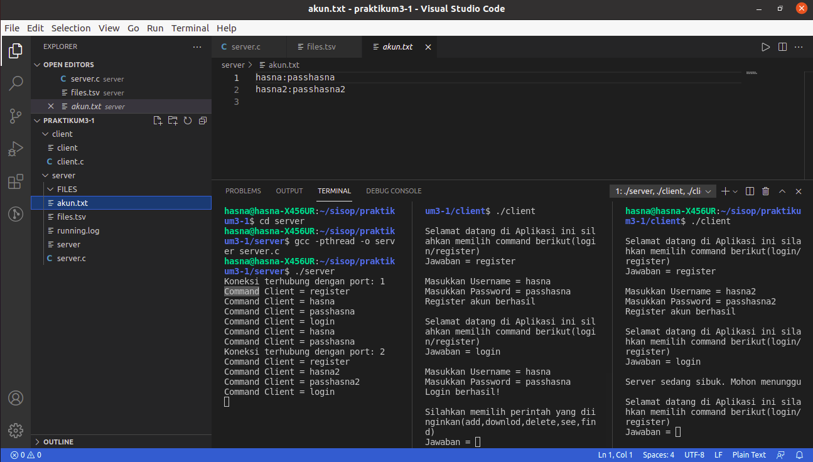
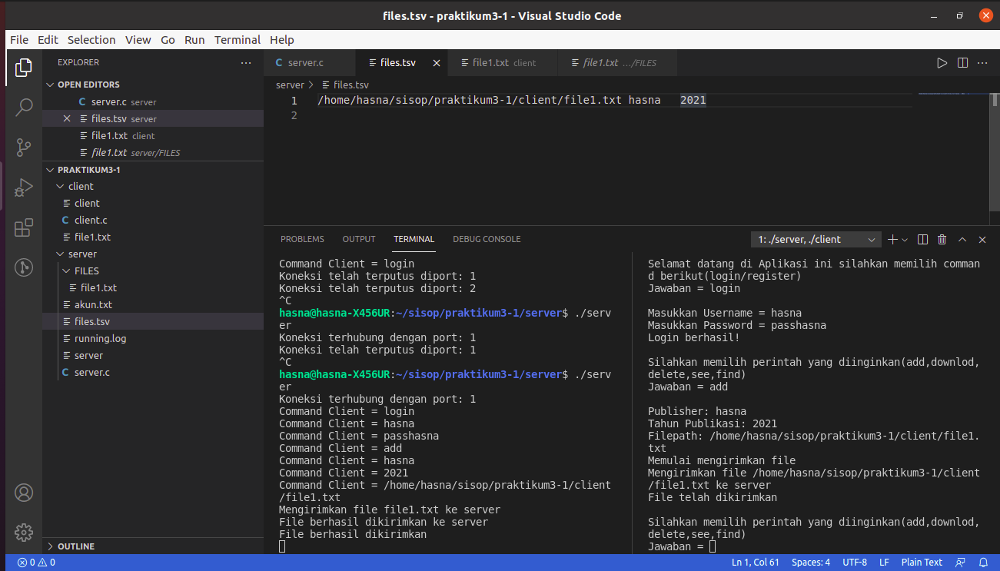
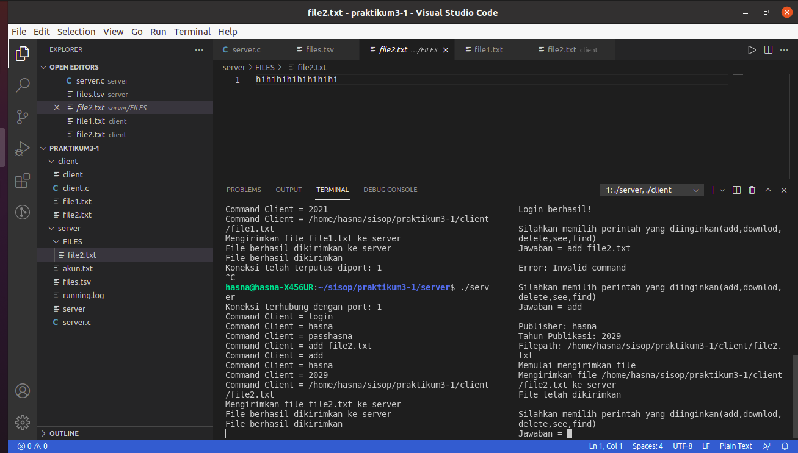
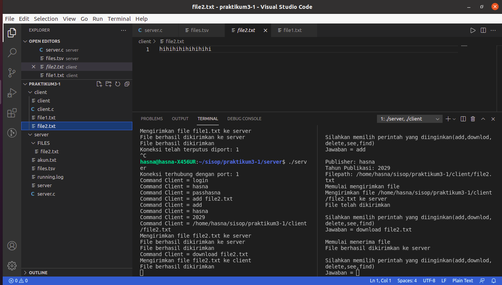
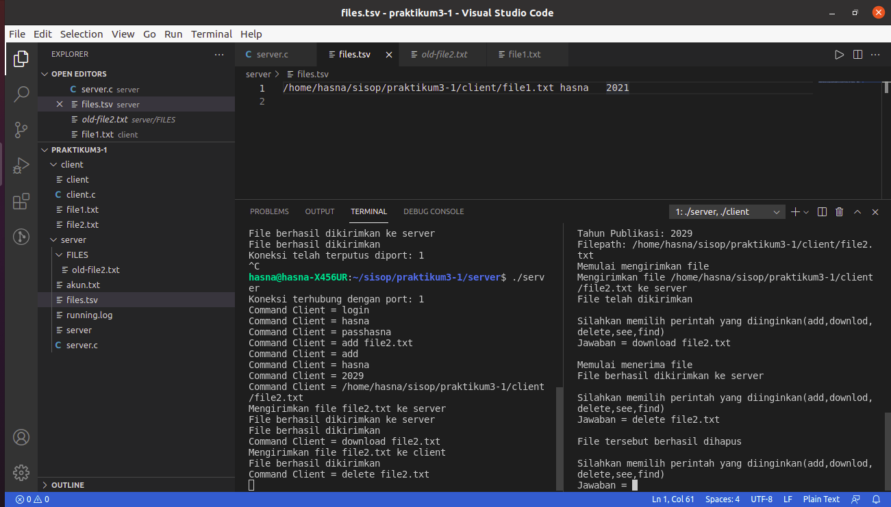
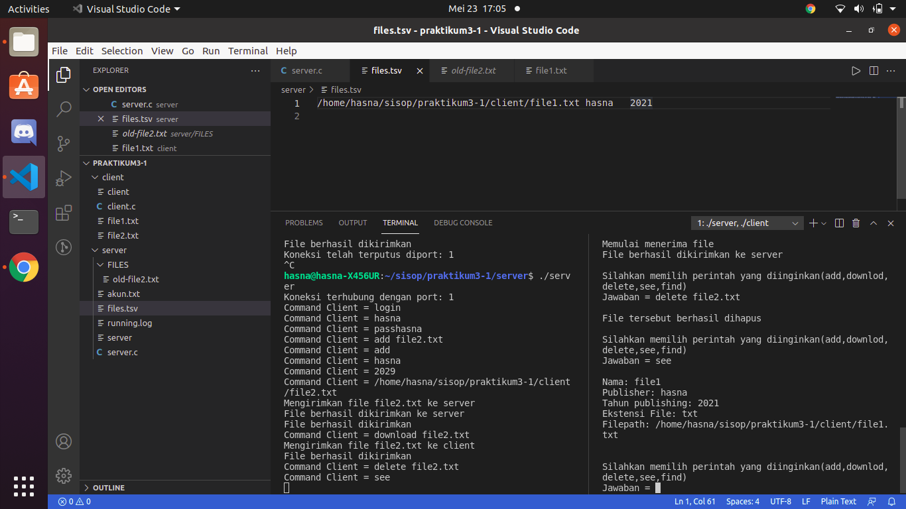
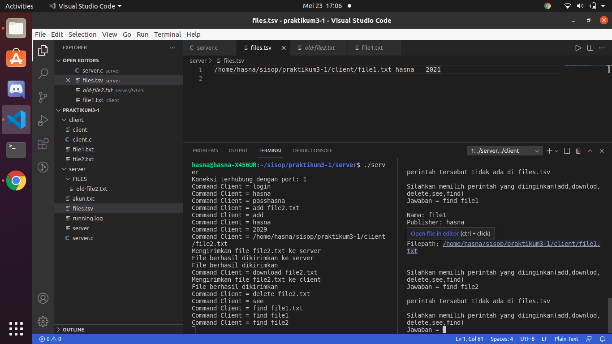
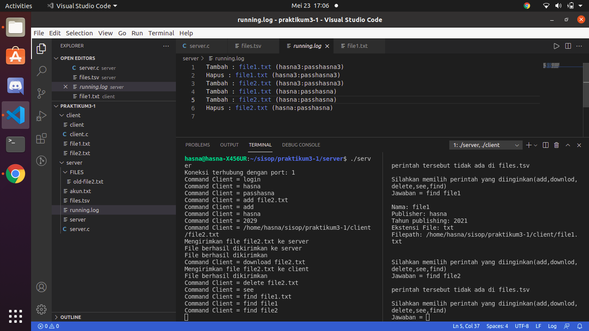

# soal-shift-sisop-modul-3-A07-2021

Soal Shift Modul 3 |  Sistem Operasi 2021

1. Zahra Dyah Meilani 05111940000069
2. Ghifari Astaudi' Ukmullah 05111940000012
3. Fairuz Hasna Rofifah 05111940000003

## SOAL NO 1
### 1A
Sistem dapat menggunakan multi-connections.

Pada saat penggunaan yang menginginkan multi-connections maka kita membutuhkan thread sebagai alat untuk melakukan aktifitas tersebut. Oleh karena itu disini dibuat dua buah thread untuk mengakomodasi hal tersebut untuk menyimpan username dan password. 

```c
//client
int main(int argc, char const *argv[])
{
    pthread_t tid[2];
    int fdc = create_socket();
    //bisa menghandle client banyak
    //minta masukka username
    pthread_create(&(tid[0]), NULL, &cekoutput, (void *) &fdc);
    //minta masukkan email
    pthread_create(&(tid[1]), NULL, &cekinput, (void *) &fdc);
    //joinkan
    pthread_join(tid[0], NULL);
    pthread_join(tid[1], NULL);
    close(fdc);
    return 0;
}

```

```c
//register
void daftar(char *messages, int fd)
{
    char id[300], password[300];
    FILE *fp = fopen("akun.txt", "a+");

    if (validasi(fd, id, password) != 0) {
        if (sudahregister(fp, id)) {
            send(fd, "Username tersebut sudah ada\n", SIZE_BUFFER, 0);
        } else {
            fprintf(fp, "%s:%s\n", id, password);
            send(fd, "Register akun berhasil\n", SIZE_BUFFER, 0);
        }
    }
    fclose(fp);
}

//login
void login(char *messages, int fd)
{
    if (socketawal != -1) {
        send(fd, "Server sedang sibuk. Mohon menunggu\n", SIZE_BUFFER, 0);
        return;
    }
    //buka akun
    char id[300], password[300];
    FILE *fp = fopen("akun.txt", "a+");
    //cek apakah berhasil
    if (validasi(fd, id, password) != 0) {
        if (loginberhasil(fp, id, password)) {
            send(fd, "Login berhasil!\n", SIZE_BUFFER, 0);
            socketawal = fd;
            strcpy(validator[0], id);
            strcpy(validator[1], password);
        } else {
            send(fd, "Username atau password salah!\n", SIZE_BUFFER, 0);
        }
    }
    fclose(fp);
}

```
### 1B

Sistem memiliki sebuah database yang bernama files.tsv. Isi dari files.tsv ini adalah path file saat berada di server, publisher, dan tahun publikasi.

Setiap memasukkan sesuatu akan dideteksi dan akan dimasukkan ke database yaitu files.tsv disemua fungsi terdapat semua open files.tsv untuk mencatat apakah data tersebut ditambahkan atau dihapus.

```c
void add(char *messages, int fd)
{
    char *dirName = "FILES";
    char publisher[300], year[300], client_path[300];
    sleep(0.001);
    if (ambilinput(fd, "Publisher: ", publisher) == 0) return;
    if (ambilinput(fd, "Tahun Publikasi: ", year) == 0) return;
    if (ambilinput(fd, "Filepath: ", client_path) == 0) return;

    FILE *fp = fopen("files.tsv", "a+");
    char *fileName = ceknamafile(client_path);

    if (sudahdownload(fp, fileName)) {
        send(fd, "File yang anda upload sudah ada\n", SIZE_BUFFER, 0);
    } else {
        send(fd, "Memulai mengirimkan file\n", SIZE_BUFFER, 0);
        mkdir(dirName, 0777);
        if (masukkanfile(fd, dirName, fileName) == 0) {
            fprintf(fp, "%s\t%s\t%s\n", client_path, publisher, year);
            printf("File berhasil dikirimkan\n");
            runninglog("add", fileName);
        } else {
            printf("Error occured when receiving file\n");
        }
    }
    fclose(fp);
}
```

### 1C

Client dapat menggunakan command `add` untuk menambahkan data buku.

Disini perlu melakukan pengecekkan apakah data tersebut sudah ada atau belum. Apabila data tersebut belum ada maka akan dilakukan input data seperti diabawah ini.

```c
void add(char *messages, int fd)
{
    char *dirName = "FILES";
    char publisher[300], year[300], client_path[300];
    sleep(0.001);
    if (ambilinput(fd, "Publisher: ", publisher) == 0) return;
    if (ambilinput(fd, "Tahun Publikasi: ", year) == 0) return;
    if (ambilinput(fd, "Filepath: ", client_path) == 0) return;

    FILE *fp = fopen("files.tsv", "a+");
    char *fileName = ceknamafile(client_path);

    if (sudahdownload(fp, fileName)) {
        send(fd, "File yang anda upload sudah ada\n", SIZE_BUFFER, 0);
    } else {
        send(fd, "Memulai mengirimkan file\n", SIZE_BUFFER, 0);
        mkdir(dirName, 0777);
        if (masukkanfile(fd, dirName, fileName) == 0) {
            fprintf(fp, "%s\t%s\t%s\n", client_path, publisher, year);
            printf("File berhasil dikirimkan\n");
            runninglog("add", fileName);
        } else {
            printf("Error occured when receiving file\n");
        }
    }
    fclose(fp);
}


### 3d
Client dapat mendownload

Disini dibuat sebuah fungsi yang berguna untuk melakukan pengecekkan sehingga dibutuhkan pesan error apabila file tersebut tidak ada, dan memberikan peringatan juga agar file tersebut tidak duplikat.

```c
void download(char *filename, int fd)
{
    FILE *fp = fopen("files.tsv", "a+");
    if (sudahdownload(fp, filename)) {
        kirim(fd, filename);
    } else {
        send(fd, "File tersebut tidak ada\n", SIZE_BUFFER, 0);
    }
    fclose(fp);
}
```

### 1e
Client dapat menghapus file yang tersimpan dalam server.

Disini dibuat sebuah fungsi delete yang berguna untuk melakukan penghapusan data di files.tsv serta menambahkan history di running.log

```c
void hapus(char *filename, int fd)
{
    //buka file
    FILE *fp = fopen("files.tsv", "a+");
    char db[300], currFilePath[300], publisher[300], year[300];
    if (sudahdownload(fp, filename)) {
        rewind(fp);
        FILE *tmp_fp = fopen("temp.tsv", "a+");
        //buat sebuah temp supaya pada saat pertukaran data tidak berubah2
        while (fgets(db, SIZE_BUFFER, fp)) {
            sscanf(db, "%s\t%s\t%s", currFilePath, publisher, year);
            if (strcmp(ceknamafile(currFilePath), filename) != 0) { 
                fprintf(tmp_fp, "%s", db);
            }
            memset(db, 0, SIZE_BUFFER);
        }
        fclose(tmp_fp);
        fclose(fp);
        remove("files.tsv");
        rename("temp.tsv", "files.tsv");
        char deletedFileName[300];
        sprintf(deletedFileName, "FILES/%s", filename);
        char newFileName[300];
        sprintf(newFileName, "FILES/old-%s", filename);
        rename(deletedFileName, newFileName);
        send(fd, "File tersebut berhasil dihapus\n", SIZE_BUFFER, 0);
        runninglog("delete", filename);
    } 
    else {
        send(fd, "File gagal didownload\n", SIZE_BUFFER, 0);
        fclose(fp);
    }
}
```


### 1f

Client dapat melihat semua isi files.tsv dengan memanggil suatu perintah yang bernama see.

Disini dibuat sebuah fungsi yang bertujuan untuk melihat data di files.tsv untuk memastikan data tersebut ada dengan membuat fitur boolean sehingga bisa digunakan didua kondisi. Kondisi see dan find dengan menggunakan strstr

```c
void see(char *buf, int fd, bool isFind)
{
    int counter = 0;
    FILE *src = fopen("files.tsv", "r");
    if (!src) {
        write(fd, "Files.tsv not found\n", SIZE_BUFFER);
        return;
    }

    char temp[300 + 85], namafile[300/3], ext[5],
        filepath[300/3], publisher[300/3], year[10];
        
    while (fscanf(src, "%s\t%s\t%s", filepath, publisher, year) != EOF) {
        pemisahfile(filepath, namafile, ext);
        if (isFind && strstr(namafile, buf) == NULL) continue;
        counter++;

        sprintf(temp, 
            "Nama: %s\nPublisher: %s\nTahun publishing: %s\nEkstensi File: %s\nFilepath: %s\n\n",
            namafile, publisher, year, ext, filepath
        );
        write(fd, temp, SIZE_BUFFER);
        sleep(0.001);
    }
    if(counter == 0) {
        if (isFind) write(fd, "perintah tersebut tidak ada di files.tsv\n", SIZE_BUFFER);
        else write(fd, "Data tidak ada di database files.tsv\n", SIZE_BUFFER);
    } 
    fclose(src);
}

```

### 1g

Client dapat menggunakan command find.

Di sini dibuat sekaligus dengan fungsi see untuk upaya tidak doublenya pencarian. Karena disini mengecek data yang dengan menggunakan strstr.

``` c
void see(char *buf, int fd, bool isFind)
{
    int counter = 0;
    FILE *src = fopen("files.tsv", "r");
    if (!src) {
        write(fd, "Files.tsv not found\n", SIZE_BUFFER);
        return;
    }

    char temp[300 + 85], namafile[300/3], ext[5],
        filepath[300/3], publisher[300/3], year[10];
        
    while (fscanf(src, "%s\t%s\t%s", filepath, publisher, year) != EOF) {
        pemisahfile(filepath, namafile, ext);
        if (isFind && strstr(namafile, buf) == NULL) continue;
        counter++;

        sprintf(temp, 
            "Nama: %s\nPublisher: %s\nTahun publishing: %s\nEkstensi File: %s\nFilepath: %s\n\n",
            namafile, publisher, year, ext, filepath
        );
        write(fd, temp, SIZE_BUFFER);
        sleep(0.001);
    }
    if(counter == 0) {
        if (isFind) write(fd, "perintah tersebut tidak ada di files.tsv\n", SIZE_BUFFER);
        else write(fd, "Data tidak ada di database files.tsv\n", SIZE_BUFFER);
    } 
    fclose(src);
}

```

### 1h
Ada log berupa `running.log`.

Di sini dibuat sebuah fungsi yang bertujuan untuk mengecek apakah ada penambahan atau pengurangan data sehingga fungsi ini dimasukkan kedalam fungsi penambahan dan fungsi pengurangan untuk pengecekkan.

```c
void runninglog(char *cmd, char *filename)
{
    FILE *fp = fopen("running.log", "a+");
    cmd = (strcmp(cmd, "add") == 0) ? "Tambah" : "Hapus";
    fprintf(fp, "%s : %s (%s:%s)\n", cmd, filename, validator[0], validator[1]);
    fclose(fp);
}
```
### Kendala
1. Tidak bisa menngunakan multi-connections, hanya single-connections
2. Segmentations fault(core dumped)
3. Hanya dapat login satu client, tidak dapat join dengan banyak client.
4. Kesulitan dalam melakukan transfer file. 
### Screenshot
#### 1a

#### 1b

#### 1c

#### 1d

 #### 1e

#### 1f

#### 1g

#### 1h

### **2a. Perkalian Matriks**

> Source Code 
 > **[soal2a.c](https://github.com/meizee/soal-shift-sisop-modul-3-A07-2021/blob/main/soal2/soal2a.c)**

>"Membuat program perkalian matrix (4x3 dengan 3x6) dan menampilkan hasilnya. Matriks nantinya akan berisi angka 1-20 (tidak perlu dibuat filter angka)."

Pertama, kita inisasi terlebih dahulu variabel global yang dibutuhkan, `tid` yang digunakan untuk thread, `a_glob` dan `b_glob` untuk menyimpan variabel matriks a dan b, dan `result_matrix` sebagai matriks hasil perkalian.
```C
pthread_t tid[4];
long long int a_glob[4][3], b_glob[3][6];
long long int (*result_matrix)[6];
```

Fungsi untuk melakukan perhitungan perkalian dari matriks dengan menggunakan thread sebanyak empat. Setiap thread akan menghitung nilai sel matriks dalam satu barisnya, sesuai aturan perkalian matriks. 

```C
void *mult_matrix(void *arg){
    pthread_t id = pthread_self();

    if(pthread_equal(id, tid[0])) {
        for(int i=0; i<6; i++) {
            result_matrix[0][i] = (a_glob[0][0] * b_glob[0][i]) + (a_glob[0][1] * b_glob[1][i]) + (a_glob[0][2] * b_glob[2][i]);
        }
    }

    else if(pthread_equal(id, tid[1])) {
        for(int i=0; i<6; i++) {
            result_matrix[1][i] = a_glob[1][0] * b_glob[0][i] + a_glob[1][1] * b_glob[1][i] + a_glob[1][2] * b_glob[2][i];
        }
    }

    else if(pthread_equal(id, tid[2])) {
        for(int i=0; i<6; i++) {
            result_matrix[2][i] = a_glob[2][0] * b_glob[0][i] + a_glob[2][1] * b_glob[1][i] + a_glob[2][2] * b_glob[2][i];
        }
    }

    else{
        for(int i=0; i<6; i++) {
            result_matrix[3][i] = a_glob[3][0] * b_glob[0][i] + a_glob[3][1] * b_glob[1][i] + a_glob[3][2] * b_glob[2][i];
        }
    }
}
```

Dalam main, kita inisiasi variabel-variabel yang dibutuhkan untuk melakukan shared memory, `key`, `shmid`, dan `result_matrix` (yang mana merupakan matriks hasil perkalian yang nantinya digunakan di soal 2b.)
```C
    key_t key = 1112;
    int shmid = shmget(key, sizeof(int[4][6]), 0666 | IPC_CREAT); 
    result_matrix = shmat(shmid,NULL,0);
```

Dan inisiasi variabel `matrix_a` yang berukuran 4x3 dan `matrix_b` yang berukuran 3x6.
```C
long long int matrix_a[4][3] = {
    {4, 1, 4},
    {2, 1, 3},
    {4, 2, 2},
    {1, 1, 4}
}; 
    
long long int matrix_b[3][6] ={
    {2, 1, 3, 2, 0, 3},
    {1, 4, 4, 0, 0, 2},
    {1, 1, 0, 1, 2, 1}
};
```

Selanjutnya berikut ini untuk menampilkan setiap nilai matriks A dan matriks B:
```C
printf("Matrix a:\n");
    for(int i=0; i<4; i++) {
        for(int j=0; j<3; j++){
            a_glob[i][j] = matrix_a[i][j];
            printf("%4lld ", a_glob[i][j]);
        }
        printf("\n");
    }

    printf("\nMatrix b:\n");
    for(int i=0; i<3; i++) {
        for(int j=0; j<6; j++){
            b_glob[i][j] = matrix_b[i][j];
            printf("%4lld ", b_glob[i][j]);
        }
        printf("\n");
    }
```

Setelah itu, kita perlu membuat thread dengan command `pthread_create` sebanyak empat untuk melakukan perkalian matrix dengan fungsi `mult_matrix`.
```C
for(int i=0; i<4; i++)
    {
        pthread_create(&(tid[i]), NULL, &mult_matrix, NULL); 
    }
````

Melakukan penggabungan/join pada semua thread ke program utama
```C
pthread_join(tid[0], NULL);
pthread_join(tid[1], NULL);
pthread_join(tid[2], NULL);
pthread_join(tid[3], NULL);
```

Print hasil matriks perkalian yang telah dihitung
```C
    printf("\nResult Matrix:\n");
    for(int i=0; i<4; i++){
        for(int j=0; j<6; j++)
        {
            printf("%4lld ", result_matrix[i][j]);
        }
        printf("\n");
    }
```

Melakukan detach proses yang sudah di-attach pada shared memory
```C
shmdt(result_matrix);
exit(0);
```

#### **Screenshot**:


### **2b. Operasi Matriks dengan Shared Memory**

> Source Code 
 > **[soal2b.c](https://github.com/meizee/soal-shift-sisop-modul-3-A07-2021/blob/main/soal2/soal2b.c)**

>"Membuat program dengan menggunakan matriks output dari program sebelumnya (program soal2a.c) (Catatan!: gunakan shared memory). Kemudian matriks tersebut akan dilakukan perhitungan dengan matrix baru (input user) sebagai berikut contoh perhitungan untuk matriks yang a da. Perhitungannya adalah setiap cel yang berasal dari matriks A menjadi angka untuk faktorial, lalu cel dari matriks B menjadi batas maksimal faktorialnya matri(dari paling besar ke paling kecil) (Catatan!: gunakan thread untuk perhitungan di setiap cel)."

Pertama, kita inisasi terlebih dahulu variabel global yang dibutuhkan, `tid` yang digunakan untuk thread dengan ukuran 24 karena kita akan membuat thread di setiap sel matriks, `a_glob` dan `b_glob` untuk menyimpan variabel matriks a dan b, dan `result_matrix` sebagai matriks hasil operasi.
```C
pthread_t tid[24];
long long  int a_glob[4][6], b_glob[4][6];
long long int output[4][6];
long long int (*result_matrix)[6];
```

Selanjutnya membuat dua fungsi faktorial yang diperlukan dalam operasi dua matriks, yaitu fungsi `factorial1` dan `factorial2`

`factorial2` digunakan untuk mempermudah perhitungan a!/(a-b)!
```C
long long int factorial2(int m, int n){
    long long int res=1;
    for(int j=m; j>n; j--){
        res = res*j;
    }
    return res;
}
```

`factorial1` digunakan untuk melakukan perhitungan a!
```C
long long int factorial1(int n){
    if(n>=1){
        return n*factorial1(n-1);
    }
    else{
        return 1;
    }
}
```

Selanjutnya membuat fungsi ``mut_matrix` untuk melakukan operasi pada kedua matriks. Di dalamnya ada conditional statement sebagai berikut:
1. Jika nilai suatu sel di matriks A (a) lebih besar atau sama dengan nilai sel di matriks B (b), maka nilai sel `output` sama dengan a!/(a-b)!. Untuk perhitungannya akan menggunakan fungsi `factorial2` dengan argumen nilai a dan nilai a-b.
2. Jika nilai suatu sel di matriks B (b) lebih besar daripada nilai sel di matriks A (a), maka nilai sel `output` sama dengan a!. Untuk perhitungannya akan menggunakan fungsi `factorial1` dengan argumen nilai a.
3. Jika nilai sel di matriks A atau matriks B sama dengan 0, maka nilai sel `output` juga sama dengan 0.

```C
void *mult_matrix(void *arg){
    for(int i=0; i<4; i++){
        for(int j=0; j<6; j++) {
            pthread_t id = pthread_self();
            int index = 0;
            if(pthread_equal(id, tid[index])) {

                //If a >= b -> a!/(a-b)!
                if(a_glob[i][j] >= b_glob[i][j]){
                    output[i][j] = factorial2(a_glob[i][j], (a_glob[i][j] - b_glob[i][j]));
                }

                //If b > a -> a!
                if(b_glob[i][j] > a_glob[i][j]){
                    output[i][j] = factorial1(a_glob[i][j]);
                }

                //If 0 -> 0
                if(a_glob[i][j] == 0 || b_glob[i][j] == 0){
                    output[i][j] = 0;
                }

                index++;
                }
            }
        
    }
}
```

Dalam main, kita inisiasi variabel-variabel yang dibutuhkan untuk melakukan attach shared memory, `key`, `shmid`, dan `result_matrix` (yang mana merupakan matriks hasil perkalian dari soal 2a.)
```C
key_t key = 1112;
int shmid = shmget(key,sizeof(int[4][6]), 0666 | IPC_CREAT);  
result_matrix =  shmat(shmid,NULL,0);
```

Inisiasi variabel `matrix_b`
```C
long long int matrix_b[4][6] = { 
    {14, 2, 3, 8, 8, 10},
    {7, 4, 8, 5, 14, 9},
    {9, 2, 13, 5, 11, 2},
    {8, 7, 10, 4, 10, 8}
};
```

Menampilkan nilai matriks A (yang merupakan matriks hasil perhitungan di soal 2a)
```C
printf("Matrix a:\n");
    for(int k=0; k<4; k++) {
        for(int l=0; l<6; l++){
            //printf("%4d ", result_matrix[k][l]);
            a_glob[k][l] = result_matrix[k][l];
            printf("%4lld ", a_glob[k][l]);
        }
        printf("\n");
    }
```

Menampilkan matriks B
```C
    printf("\nMatrix b:\n");
    for(int k=0; k<4; k++) {
        for(int l=0; l<6; l++){
            b_glob[k][l] = matrix_b[k][l];
            printf("%lld ", b_glob[k][l]);
        }
        printf("\n");
    }
```

Setelah itu, kita perlu membuat thread dengan command `pthread_create` sebanyak 24 karena diminta untuk menggunakan thread untuk melakukan operasi pada setiap sel di matrix dengan fungsi `mult_matrix`.
```C
for(int i=0; i<24; i++)
    {
        pthread_create(&(tid[i]), NULL, &mult_matrix, NULL); 
    }
````

Melakukan penggabungan/join pada semua thread ke program utama
```C
for(int i=0; i<24; i++){
    pthread_join(tid[i], NULL);
}
```

Print hasil matriks perkalian yang telah dihitung
```C
printf("\nResult Matrix:\n");
for(int i=0; i<4; i++){
    for(int j=0; j<6; j++)
    {
        printf("%4lld ", output[i][j]);
    }
printf("\n");
}
```

Melakukan detach proses yang sudah di-attach pada shared memory
```C
shmdt(result_matrix); 
shmctl(shmid,IPC_RMID,NULL); 
exit(0);
```

#### **Screenshot:**


### **2c. Mengecek Proses Teratas dengan Pipe**

> Source Code 
 > **[soal2c.c](https://github.com/meizee/soal-shift-sisop-modul-3-A07-2021/blob/main/soal2/soal2c.c)**

>"Karena takut lag dalam pengerjaannya membantu Loba, Crypto juga membuat program (soal2c.c) untuk mengecek 5 proses teratas apa saja yang memakan resource komputernya dengan command “ps aux | sort -nrk 3,3 | head -5” (Catatan!: Harus menggunakan IPC Pipes)"

Pertama, kita inisiasi variabel yang dibutuhkan, `fd1` dan `fd2` digunakan untuk menyimpan dua output dari masing-masing pipe. `argv1` digunakan untuk menyimpan command `ps aux`. `argv2` digunakan untuk menyimpan command `sort`. Dan `argv3` digunakan untuk menyimpan command `head`.

```C
int fd1[2]; // Used to store two ends of first pipe 
int fd2[2]; // Used to store two ends of second pipe 
char *argv1[] = {"ps", "aux", NULL};
char *argv2[] = {"sort", "-nrk", "3,3", NULL};
char *argv3[] = {"head", "-5", NULL};
pid_t p;
```

Membuat pipe dengan bantuan fd1 dan fd2, jika pembuatan pipe gagal, maka akan menampilkan pesan "Pipe Failed".
```C
if (pipe(fd1)==-1) { 
	fprintf(stderr, "Pipe Failed" ); 
	return 1; 
} 
if (pipe(fd2)==-1) { 
    fprintf(stderr, "Pipe Failed" ); 
    return 1; 
} 
```

Selanjutnya, melakukan spawning proses dengan fork, dan tampilkan pesan error jika fork gagal
```C
p = fork(); 

if (p < 0) { 
	fprintf(stderr, "fork Failed" ); 
	return 1; 
}
```

Pada parent proses akan dieksekusi command `ps aux` beserta argumennya dengan fungsi `execv` dan dikirimkan data output dengan variabel fd1 menggunakan `dup2`.
```C
// Parent process 
else if (p == 0) { 
	close(fd1[0]);
        dup2(fd1[1], STDOUT_FILENO);
        execv("/bin/ps", argv1); 
} 
```

Selanjutnya, pada child process akan dilakukan fork lagi sehingga menghasilkan proses baru dan dilakukan pengecekan apakah fork berhasil dibuat atau tidak. 

Di dalam proses baru ini, parent process akan menerima data input dengan variabel fd1, juga mengeksekusi command `sort` dan argumennya dengan `execv`. Selanjutnya mengirimkan data output dengan variabel fd2.

Pada child process-nya akan menerima data input dengan variabel fd2, dan melakukan eksekusi command `head` dan argumennya menggunakan fungsi `execv`.
```C
// child process 
else{ 
        wait(NULL);
        pid_t p2;
        p2 = fork();

        if(p2 < 0){
            fprintf(stderr, "fork Failed" ); 
		    return 1; 
      	}

	else if(p2==0){
		close(fd1[1]);
		dup2(fd1[0], STDIN_FILENO);
		close(fd2[0]);
		dup2(fd2[1], STDOUT_FILENO);
		execv("/bin/sort", argv2);
	}

	else{
		close(fd1[0]);
		close(fd1[1]);

		close(fd2[1]);
		dup2(fd2[0], STDIN_FILENO);
		close(fd2[0]);

		execv("/bin/head", argv3);
	}
```

#### **Screenshot:**


### **Kendala**
1. Tidak bisa melakukan passing variable saat membuat thread, sehingga saya gunakan global variabel pada fungsi `mult_matrix`
2. Sempat mengalami overflow pada test case yang diujikan saat demo karena menggunakan tipe data `int`, solusinya dengan mengubah tipe data pada matriks menjadi `long long int`


## **3. Ayub Mengkategorikan File**

> Source Code  **[soal3.c](https://github.com/meizee/soal-shift-sisop-modul-3-A07-2021/blob/main/soal3/soal3.c)**

Program dapat:
1. Program dapat menerima argumen `-f` untuk mengkategorikan file.
`cmd$ ./soal3 -f path/to/file1.jpg path/to/file2.c path/to/file3.zip`
2. Program dapat menerima argumen `-d` untuk mengkategorikan file dalam directory.
`$ ./soal3 -d /path/to/directory/`
3. Program dapat menerim argumen `*` untuk mengkategorikan file yang berada pada working directory.
`$ ./soal3 \*`

```c
#include <ctype.h>
#include <dirent.h>
#include <limits.h>
#include <pthread.h>
#include <stdbool.h>
#include <stdio.h>
#include <stdlib.h>
#include <string.h>
#include <sys/stat.h>
#include <unistd.h>

char listFile[2048][PATH_MAX];

bool isExistAndRegFile();
void *pindahFile();
int listFilesFromDirectory();

int main(int argc, char *argv[]) {
    if (argc < 2) {
        printf("Butuh argumen.\n");
        exit(1);
        return 0;
    }
```
Agar program selalu menerima argumen.
```c

    char pathAwal[PATH_MAX];
```
`pathAwal` adalah working directory.
```c

    if (strcmp(argv[1], "*") == 0) {
        if (getcwd(pathAwal, sizeof(pathAwal)) == NULL) {
            perror("getcwd() error");
            return 0;
        }
```
Jika argumen program adalah `*`. Cek apakah ada string path working directory.
```c
    } else if (strcmp(argv[1], "-f") == 0) {
        if (argc < 3) {
            printf("Butuh argumen minimal 1 path menuju file.\n");
            return 0;
        }

        pthread_t tid[argc - 2];

        for (int i = 2; i < argc; i++) {
            pthread_create(&(tid[i - 2]), NULL, pindahFile, (void *)argv[i]);
        }

        for (int i = 0; i < argc - 2; i++) {
            int isBerhasilJoin;
            void *ptr;
            pthread_join(tid[i], &ptr);
            isBerhasilJoin = (int)ptr;

            if (isBerhasilJoin) {
                printf("File %d : Berhasil Dikategorikan\n", i + 1);
            } else {
                printf("File %d : Sad, gagal :(\n", i + 1);
            }
        }

        return 0;
```
Jika argumen adalah `-f`. Di sini ada cegatan argumen. Selain itu juga membuat thread, 1 thread untuk 1 file. Kemudian thread dijoin agar thread **main** tidak selesai lebih dahulu (jika **main** selesai, maka proses main akan selesai dan thread lain tidak akan berjalan).
```c
    } else if (strcmp(argv[1], "-d") == 0) {
        if (argc == 3) {
            strcpy(pathAwal, argv[2]);           
        } else {
            printf("Argumen hanya 1 untuk direktori.\n");
            return 0;
        }
```
Cegatan argumen untuk argumen `-d`.
```c
    } else {
        printf("Argumen tidak valid.\n");
    }

    int jumlahFile = 0;
    if (!listFilesFromDirectory(pathAwal, &jumlahFile)) {
        printf("Yah, gagal disimpan :(\n");
        return 0;
    }

    pthread_t tid[jumlahFile];
    for (int i = 0; i < jumlahFile; i++) {
        pthread_create(&(tid[i]), NULL, pindahFile, (void *)listFile[i]);
    }

    for (int i = 0; i < jumlahFile; i++) {
        void *ptr;
        pthread_join(tid[i], &ptr);
    }

    if (strcmp(argv[1], "-d") == 0) {
        printf("Direktori sukses disimpan!\n");
    }

    return 0;
}
```
Untuk join thread untuk argumen `-d` dan `*`. Menggunakan fungsi `listFilesFromDirectory()` untuk mendapatkan list path file-file dalam direktori secara rekursif. List path file disimpan pada array global `listFile[]`.
```c

void getFileExtension(char *namaFile, char *returnExten) {
    char *ext = strchr(namaFile, '.');
    if (ext == NULL) {
        strcpy(returnExten, "Unknown");
    } else if (ext == namaFile) {
        strcpy(returnExten, "Hidden");
    } else {
        strcpy(returnExten, ext + 1);
    }
}
```
Untuk mendapatkan extension suatu file.
```c

bool isExistAndRegFile(char *pathAwal) {
    struct stat bf;
    int exist = stat(pathAwal, &bf);
    if (exist == 0) {
        if (S_ISREG(bf.st_mode)) {
            return true;
        }
        else {
            return false;
        }
    } else {
        return false;
    }
}
```
Untuk mengecek apakah suatu file ada dan merupakan file reguler.
```c

void *pindahFile(void *arg) {
    char pathAwal[PATH_MAX];
    strcpy(pathAwal, (char *)arg);

    if (isExistAndRegFile(pathAwal)) {

        const char *p = "/";
        char *a, *b;
        char full_path[PATH_MAX];
        strcpy(full_path, (char *)arg);

        char namaFile[100];

        for (a = strtok_r(full_path, p, &b); a != NULL; a = strtok_r(NULL, p, &b)) {
            memset(namaFile, 0, sizeof(namaFile));
            strcpy(namaFile, a);
        }
```
Fungsi untuk memindahkan file ke folder sesuai ekstensi. Jika file tersebut ada dan merupakan reguler, maka lanjutkan pindah file. Pertama adalah memisahkan path menggunakan `strtok` berdasarkan tanda `/` pada path filenya. Kemudian`memset` 0 dan `strcpy` selama belum null. Karena pasti nama file ada di paling ujung path, ambil yang paling terakhir saja.
```c

        char ext[PATH_MAX];
        getFileExtension(namaFile, ext);

        if (strcmp(ext, "Hidden") != 0 && strcmp(ext, "Unknown") != 0) {
            for (int i = 0; i < strlen(ext); i++) {
                ext[i] = tolower(ext[i]);
            }
        }
```
Mengambil ekstensi dari suatu file, kemudian di cek jika tidak *hidden* dan *unknown* maka ubah string `ext` menjadi lowercase agar tidak ada dua folder ekstensi yaitu uppercase dan lowercase.
```c

        char cwd[PATH_MAX];
        if (getcwd(cwd, sizeof(cwd)) == NULL) {
            perror("getcwd() error");
            return (void *)0;
        }

        char destinationDir[PATH_MAX];
        sprintf(destinationDir, "%s/%s", cwd, ext);
        mkdir(destinationDir, 0777);

        char destination[PATH_MAX];
        sprintf(destination, "%s/%s/%s", cwd, ext, namaFile);
        rename(pathAwal, destination);
        return (void *)1;
    }

    else {
        return (void *)0;
    }
}
```
Kemudian membuat (**mkdir**) direktori ekstensi tujuan dengan menggabungkan `cwd` dan `ext` menggunakan **sprintf**. Kemudian merename nama path file dengan **rename** (sama saja dengan memindahkan file).
```c
int listFilesFromDirectory(char *pathAwal, int *jumlahFile) {
    char path[PATH_MAX];
    struct dirent *dp;
    DIR *dir = opendir(pathAwal);

    if (!dir) {
        return 0;
    }

    while ((dp = readdir(dir)) != NULL) {
        if (strcmp(dp->d_name, ".") != 0 && strcmp(dp->d_name, "..") != 0) {
            char full_path[PATH_MAX];
            sprintf(full_path, "%s/%s", pathAwal, dp->d_name);
            if (isExistAndRegFile(full_path)) {
                sprintf(listFile[*jumlahFile], "%s", full_path);
                *jumlahFile += 1;
            }

            strcpy(path, pathAwal);
            strcat(path, "/");
            strcat(path, dp->d_name);

            listFilesFromDirectory(path, jumlahFile);
        }
    }

    closedir(dir);
    return 1;
}
```
Fungsi untuk menglist nama path file-file dalam direktori secara rekursif. Pertama, mencoba membuka direktori dengan **opendir** untuk mengecek apakah dia adalah direktori. Jika iya, maka buka direktori dengan **readdir**. Dan menggunakan **while** untuk menglist file-file dalam direktori tersebut, menggunakan **dp->d_name**. Kemudian memanggil fungsi `listFilesFromDirectory()` lagi untuk menglist file-file secara rekursif, jika dia merupakan folder.
### Screenshot
#### 3a

#### 3b

#### 3c

#### 3d

