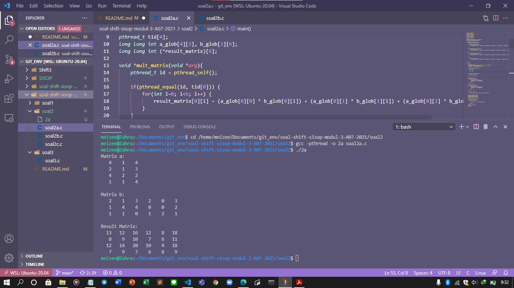
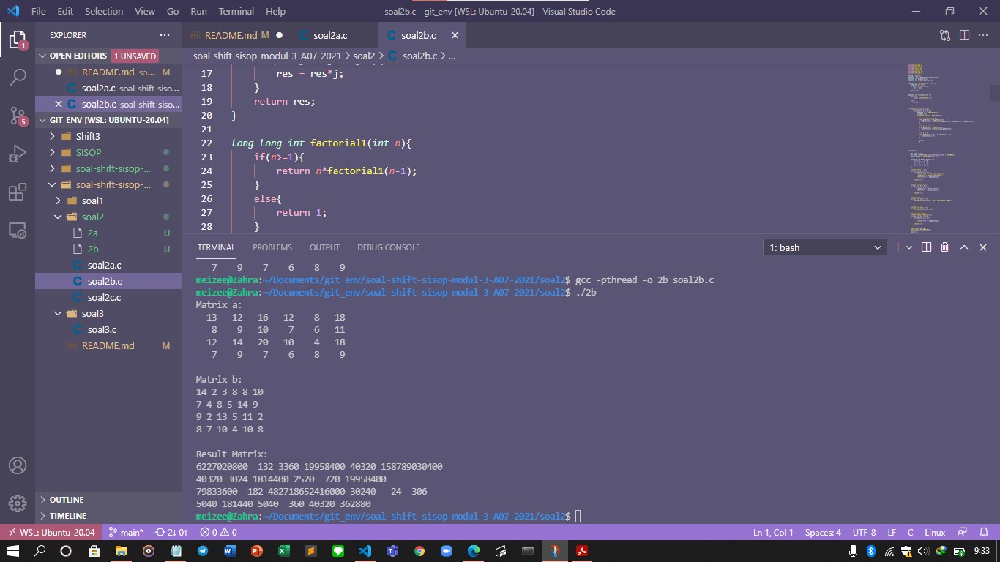
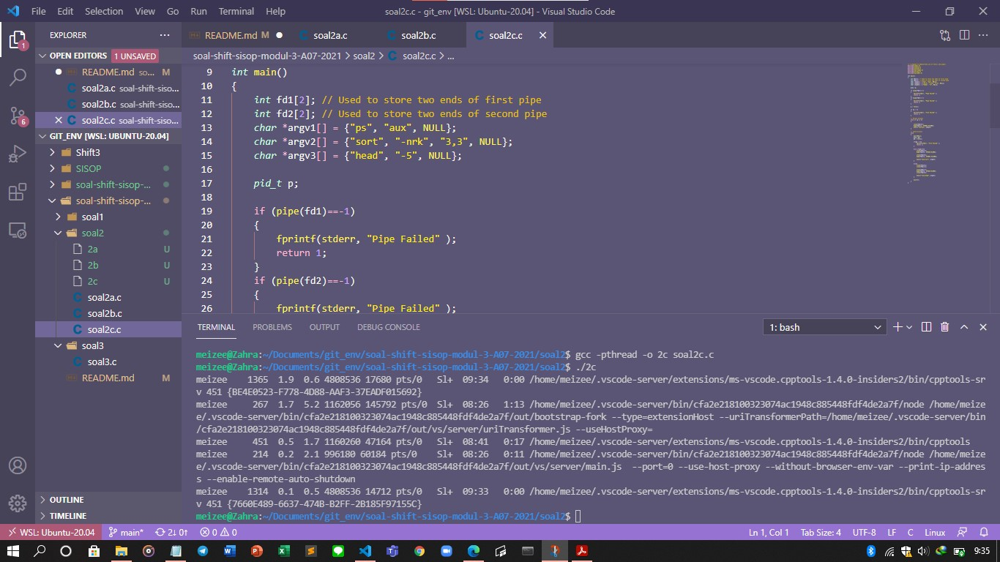
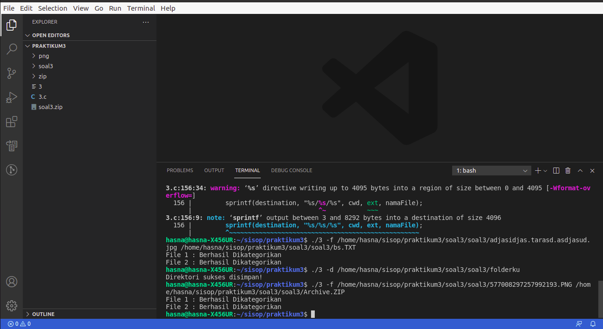
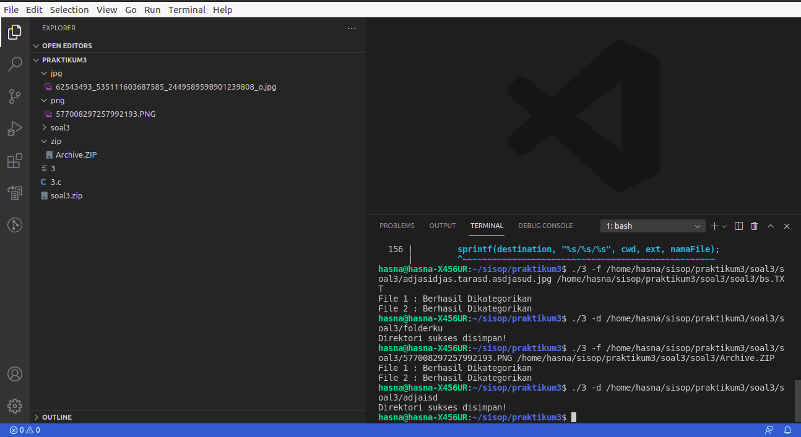
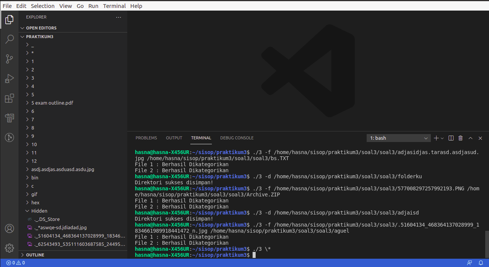
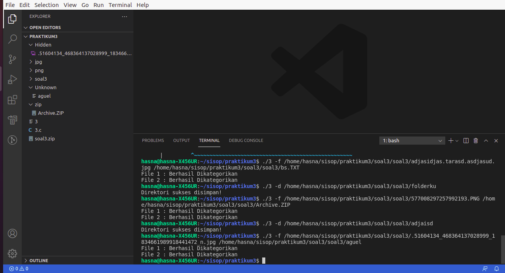

# soal-shift-sisop-modul-3-A07-2021

Soal Shift Modul 3 |  Sistem Operasi 2021

1. Zahra Dyah Meilani 05111940000069
2. Ghifari Astaudi' Ukmullah 05111940000012
3. Fairuz Hasna Rofifah 05111940000003

## SOAL NO 1
Keverk adalah orang yang cukup ambisius dan terkenal di angkatannya. Sebelum dia menjadi ketua departemen di HMTC, dia pernah mengerjakan suatu proyek dimana keverk tersebut meminta untuk membuat server database buku. Proyek ini diminta agar dapat digunakan oleh pemilik aplikasi dan diharapkan bantuannya dari pengguna aplikasi ini. 
Di dalam proyek itu, Keverk diminta: 
## 1A
Pada saat client tersambung dengan server, terdapat dua pilihan pertama, yaitu register dan login. Jika memilih register, client akan diminta input id dan passwordnya untuk dikirimkan ke server. User juga dapat melakukan login. Login berhasil jika id dan password yang dikirim dari aplikasi client sesuai dengan list akun yang ada didalam aplikasi server. Sistem ini juga dapat menerima multi-connections. Koneksi terhitung ketika aplikasi client tersambung dengan server. Jika terdapat 2 koneksi atau lebih maka harus menunggu sampai client pertama keluar untuk bisa melakukan login dan mengakses aplikasinya. Keverk menginginkan lokasi penyimpanan id dan password pada file bernama `akun.txt` dengan format :
### akun.txt`
```
id:password
id2:password2
```
#### JAWAB
Pertama, adalah membuat socket pada server dan client. Pada Server, fungsi`create_socket()` digunakan untuk membuat socket. Kemudian, pada fungsi main server, dijalankan forever loop yaitu `while(1)`, forever loop ini digunakan untuk menerima setiap ada permintaan dari client untuk menghubungkan ke server. Pada client untuk membuat socket pada client dibutuhkan fungsi `create_socket()`. Setelah server dan client berhasil dihubungkan, maka client akan membuat dua thead `InputCheck()` dan `OutputCheck()` digunakan untuk menerima inputan dari pengguna (input) yang kemudian akan diteruskan ke server dan  menerima ddsn mengecek pesan dari server apakah server terminate atau tidak dengan cara memanggil fungsi `getServerInput()`, kemudian mencetak pesan dari server (Output).
Terdapat dua pilihan inputan register atau login, ketika client memilih register, maka fungsi daftar() akan dijalankan. Pertama client diminta untuk menginputkan id dan password. Lalu,  mengecek apakah user sudah terdaftar pada file `akun.txt` dengan memanggil fungsi `registered()`. Apabila id dan password belum terdaftar pada `akun.txt`, maka id dan password user akan dicatat pada file tersebut dengan format id:password. Ketika client memilih menu login, maka fungsi `login()` akan dijalankan. Pertama yaitu apakah ada client yang terhubung dengan server. Namun apabila tidak ada yang sedang terhubung ke server, maka server akan meminta input id dan password melalui fungsi `valid()`, kemudian pada fungsi `loginsuc()` dilakukan pengecekan apakah id dan password sesuai pada file akun.txt.
SourceCode create_socket() client:
```
int create_socket()
{
    struct sockaddr_in s_address;
    int ld = socket(AF_INET, SOCK_STREAM, IPPROTO_TCP);
    int res_val, opt = 1;
    struct hostent *local_host; 
    if (ld == -1) {
        fprintf(stderr, "socket failed [%s]\n", strerror(errno));
        exit(EXIT_FAILURE);
    }
    if (setsockopt(ld, SOL_SOCKET, SO_REUSEADDR | SO_REUSEPORT, &opt, sizeof(opt))) {
        perror("setsockopt");
        exit(EXIT_FAILURE);
    }
    s_address.sin_family = AF_INET;
    s_address.sin_port = htons(7000);
    local_host = gethostbyname("127.0.0.1");
    s_address.sin_addr = *((struct in_addr *)local_host->h_addr);
    res_val = connect(ld, (struct sockaddr *)&s_address, sizeof(struct sockaddr_in));
    if (res_val == -1) {
        fprintf(stderr, "connect failed [%s]\n", strerror(errno));
        exit(EXIT_FAILURE);
    }
    return ld;
}
```
Source code InputCheck client:
```
void *InputCheck(void *fdc)
{
    int ld;
    char Input[tool] = {0};
    chdir("/home/hasna/sisop/praktikum3-1/Client");
    ld = *(int *) fdc;
    while (1) {
        gets(Input);
        send(ld, Input, maincheck, 0);
        if (check) {
            strcpy(cmd1, Input);
    }
    }
}
```
Source code OutputCheck client:

```
void *OutputCheck(void *fdc) 
{
    int ld;
    char Input[tool] = {0};
    chdir("/home/hasna/sisop/praktikum3-1/Client");
    ld = *(int *) fdc;

    while (1) 
    {
        memset(Input, 0, maincheck);
        activeserver(ld, Input);
        printf("%s", Input);
       	......
        fflush(stdout);
    }
}
```
SouceCode fungsi main client:
```
int main(int argc, char const *argv[])
{
    pthread_t tid[2];
    int fdc = create_socket();
    pthread_create(&(tid[0]), NULL, &Output, (void *) &client_fd);
    pthread_create(&(tid[1]), NULL, &InputCheck, (void *) &fdc);
    pthread_join(tid[0], NULL);
    pthread_join(tid[1], NULL);
    close(fdc);
    return 0;
}
```
SoureCode create_socket server:
```
int create_socket()
{
    struct sockaddr_in saddr;
    int ld = socket(AF_INET, SOCK_STREAM, IPPROTO_TCP);
    int res_val, opt = 1;
    
    if (ld == -1) {
        fprintf(stderr, "socket failed [%s]\n", strerror(errno));
        exit(EXIT_FAILURE);
    }
    if (setsockopt(ld, SOL_SOCKET, SO_REUSEADDR | SO_REUSEPORT, &opt, sizeof(opt))) {
        perror("setsockopt");
        exit(EXIT_FAILURE);
    }
    saddr.sin_family = AF_INET;
    saddr.sin_port = htons(7000);
    saddr.sin_addr.s_addr = INADDR_ANY;
    res_val = bind(ld, (struct sockaddr *)&saddr, sizeof(struct sockaddr_in));
    if (res_val != 0) {
        fprintf(stderr, "bind failed [%s]\n", strerror(errno));
        close(ld);
        exit(EXIT_FAILURE);
    }
    res_val = listen(ld, 5);
    if (res_val != 0) {
        fprintf(stderr, "listen failed [%s]\n", strerror(errno));
        close(ld);
        exit(EXIT_FAILURE);
    }
    return ld;
}
```
SourceCode fungsi daftar server:
```
void daftar(char *messages, int ld)
{
    char id[300], pass[300];
    FILE *file;
    file = fopen("akun.txt", "a+");

    if (valid(ld, id, pass) != 0) {
        ....
        }
    }
    fclose(file);
}
```
SourceCode fungsi login server:
```
void login(char *messages, int ld)
{
    if (sockets != -1) {
        send(ld, "Server is busy. Please wait....\n", SIZE_BUFFER, 0);
        return;
    }
    //buka akun
    char id[300], pass[300];
    FILE *file = fopen("akun.txt", "a+");
    if (valid(ld, id, pass) != 0) {
        if (loginsuc(file, id, pass)) {
            send(ld, "Login success!\n", SIZE_BUFFER, 0);
            sockets = ld;
            strcpy(validator[0], id);
            strcpy(validator[1], pass);
        } else {
            send(ld, "Username or Password is wrong!\n", SIZE_BUFFER, 0);
        }
    }
    fclose(file);
}
```
SourceCode fungsi loginsuc server:
```
bool loginsuc(FILE *file, char *id, char *pass)
{
    char bid[300], input[300];
    sprintf(input, "%s:%s", id, pass);
    while (fscanf(file, "%s", bid) != EOF) {
        if (strcmp(bid, input) == 0) return true;
    }
    return false;
}
```
SourceCode fungsi valid server:
```
int valid(int ld, char *id, char *pass)
{
    if (take_input(ld, "Input your Username = ", id) == 0) return 0;
    if (take_input(ld, "Input your Password = ", pass) == 0) return 0;
    return 1;
}
```
SourceCode fungsi registered server:
```
bool registered(FILE *file, char *id)
{
    char bid[300], *temp1;
    while (fscanf(file, "%s", bid) != EOF) {
        temp1 = strtok(bid, ":");
        if (strcmp(temp1, id) == 0) 
            return true;
    }
    return false;
}
```
SouceCode fungsi main server:
```
int main(int argc ,char const *argv1[])
{
    socklen_t addresslen;
    struct sockaddr_in new_address;
    pthread_t tid;
    char buzz[300], argv[300 + terima];
    int new_fd, res_val, server_fd = create_socket();
    while (1) {
        new_fd = accept(server_fd, (struct sockaddr *)&new_address, &addresslen);
        if (new_fd >= 0) {
            printf("the connection is connected to the port: %d\n", new_fd-3);
            pthread_create(&tid, NULL, &inti, (void *) &new_fd);
        } else {
            fprintf(stderr, "connection failed %s\n", strerror(errno));
        }
    }
    return 0;
}
```
## 1B dan 1C
Sistem memiliki sebuah database yang bernama files.tsv. Isi dari files.tsv ini adalah path file saat berada di server, publisher, dan tahun publikasi. Setiap penambahan dan penghapusan file pada folder file yang bernama  FILES pada server akan memengaruhi isi dari files.tsv. Folder FILES otomatis dibuat saat server dijalankan. 
Tidak hanya itu, Keverk juga diminta membuat fitur agar client dapat menambah file baru ke dalam server. Direktori FILES memiliki struktur direktori di bawah ini : 
### Direktori FILES
```
File1.ekstensi
File2.ekstensi
```
Pertama client mengirimkan input ke server dengan struktur sebagai berikut :
Contoh Command Client :
```
add
```

Output Client console:
```
Publisher:
Tahun Publikasi:
Filepath:
```
Kemudian, dari aplikasi client akan dimasukan data buku tersebut (perlu diingat bahwa Filepath ini merupakan path file yang akan dikirim ke server). Lalu client nanti akan melakukan pengiriman file ke aplikasi server dengan menggunakan socket. Ketika file diterima di server, maka row dari files.tsv akan bertambah sesuai dengan data terbaru yang ditambahkan.

#### JAWAB
Setelah melakukan login, maka akan diberi beberapa pilihan salah satunya adalah add. Ketika memilih add, maka fungsi `add()` akan di jalankan. Fungsi ini akan meminta inputan berupa publisher, tahun dan Filepath sesuai dengan soal yang diatas. Fungsi `take_input()` mengirim format input ke client dan akan mereturn `res_val`. Pada fungsi `OutputCheck()` client untuk mengecek pesan yang dikirim oleh server. Apabila pesan yang dikirim server adalah Filepath: , maka variable `check` akan bernilai true. Ketika user menginput filepath-nya melalui fungsi `CheckInput()`, maka filepath tersebut akan disimpan pada variabel `cmd1`. Setelah server menerima filepath dari user, maka server akan mengambil nama file yang diinputkan dari filepath dan fungsi `CeckNameFile()`. Untuk pengambilan nama file dilakukan dengan cara menyimpan string setelah tanda garis miring terakhir. Setelah server mendapatkan nama file dari inputan user, kemudian nama file akan dicek apakah sudah terdata di file `files.tsv`. Apabila belum terdata, maka server akan memanggil fungsi `downloaded()`, dan mengirimkan pesan `Start to send file`. Pada fungsi `sends()` untuk mengecek ukuran dari file yang akan dikirim ke server dan mengirim ukuran file dengan melalukan perulangan sebanyak file yang akan dikirim. Selanjutnya pada fungsi `INPUTFile()` untuk menerima ukuran file dari client dan akan dilakukan proses transfer file dari user dengan melakukan perulangan sebanyak ukuran file. Selanjutnya adalah mencetak data yang telah diinputkan patda fungsi add ke dalam file `files.tsv`, maka akan dilanjutkan dengan menulis data publisher, tahun, dan filepath pada file `files.tsv`.
SourceCode fungsi add server:
```
void add(char *messages, int ld)
{
    char *DIR = "FILES";
    char publisher[300], year[300], client_path[300];
    sleep(0.001);
    if (take_input(ld, "Publisher: ", publisher) == 0) return;
    if (take_input(ld, "Tahun Publikasi: ", year) == 0) return;
    if (take_input(ld, "Filepath: ", client_path) == 0) return;

    FILE *file = fopen("files.tsv", "a+");
    char *fileName = CeckNameFile(client_path);

    if (downloaded(file, fileName)) {
        send(ld, "file that you uploaded already exists\n", SIZE_BUFFER, 0);
    } else {
        send(ld, "Start to send file\n", SIZE_BUFFER, 0);
        mkdir(DIR, 0777);
        if (INPUTFile(ld, DIR, fileName) == 0) {
            fprintf(file, "%s\t%s\t%s\n", client_path, publisher, year);
            printf("File send successfully\n");
            runninglog("add", fileName);
        } else {
            printf("Error occured when receiving file\n");
        }
    }
    fclose(file);
}
```
SourceCode take_input server:
```
int take_input(int ld, char *prompt, char *arah)
{
    send(ld, prompt, SIZE_BUFFER, 0);
    int jumlah, res_val;
    ioctl(ld, FIONREAD, &jumlah);
    jumlah /= 300;
    for (int i = 0; i <= jumlah; i++) {
        res_val = recv(ld, arah, 300, 0);
        if (res_val == 0) 
            return res_val;
    }
    while (strcmp(arah, "") == 0) {
        res_val = recv(ld, arah, 300, 0);
        if (res_val == 0) return res_val;
    }
    printf("Command Client = %s\n", arah);
    return res_val;
}
```

Source code InputCheck client:
```
void *InputCheck(void *fdc)
{
    int ld;
    char Input[tool] = {0};
    chdir("/home/hasna/sisop/praktikum3-1/Client");
    ld = *(int *) fdc;
    while (1) {
        gets(Input);
        send(ld, Input, maincheck, 0);
        if (check) {
            strcpy(cmd1, Input);
    }
    }
}
```
Source code OutputCheck client:

```
void *OutputCheck(void *fdc) 
{
    int ld;
    char Input[tool] = {0};
    chdir("/home/hasna/sisop/praktikum3-1/Client");
    ld = *(int *) fdc;

    while (1) 
    {
        memset(Input, 0, maincheck);
        activeserver(ld, Input);
        printf("%s", Input);
       	......
        fflush(stdout);
    }
}
```
SourceCode CeckNameFile server:
```
char *CeckNameFile(char *filePath)
{
    char *res = strrchr(filePath, '/');
    if (res) 
        return res + 1;
    else 
        return filePath;
}
```
SourceCode downloaded server:
```
bool downloaded(FILE *file, char *FILENM)
{
    char bid[300], *temp1;
    while (fscanf(file, "%s", bid) != EOF) {
        temp1 = CeckNameFile(strtok(bid, "\t"));
        if (strcmp(temp1, FILENM) == 0) 
            return true;
    }
    return false;
}
```
SourceCode sends server:
```
int sends(int ld, char *FILENM)
{
    char buzz[300] = {0};
    int res_val;
    printf("Send File %s ke client\n", FILENM);
    strcpy(buzz, FILENM);
    sprintf(FILENM, "FILES/%s", buzz);
    FILE *file;
    file = fopen(FILENM, "r");

    if (!file) {
        printf("File is not found\n");
        send(ld, "File is not found\n", SIZE_BUFFER, 0);
        return -1;
    }
    send(ld, "Start to receive file\n", SIZE_BUFFER, 0);
    send(ld, buzz, SIZE_BUFFER, 0);

    fseek(file, 0L, SEEK_END);
    int size = ftell(file);
    rewind(file);
    sprintf(buzz, "%d", size);
    send(ld, buzz, SIZE_BUFFER, 0);

    while ((res_val = fread(buzz, 1, 300, file)) > 0) {
        send(ld, buzz, res_val, 0);
    }
    recv(ld, buzz, 300, 0);
    printf("File sent successfully\n");
    fclose(file);
    return 0;
}
```
SourceCode fungsi INPUTFile server:
```
int INPUTFile(int ld, char *DIRname, char *targetfileN)
{
    int res_val, size;
    char buzz[300] = {0}, in[1];

    res_val = recv(ld, buzz, 300, 0);
    if (res_val == 0 || strcmp(buzz, "File was found") != 0) {
        if (res_val == 0) printf("Connection to cilent was disconnect\n");
        else puts(buzz);
            return -1;
    }
    recv(ld, buzz, SIZE_BUFFER, 0);
    size = atoi(buzz);

    printf("File sent %s to server\n", targetfileN);
    sprintf(buzz, "%s/%s", DIRname,targetfileN);
    FILE *file = fopen(buzz, "w+");

    while (size-- > 0) {
        if ((res_val = recv(ld, in, 1, 0)) < 0)
            return res_val;
            fwrite(in, 1, 1, file);
    }
    res_val = 0;
    printf("File sent successfully to server\n");
    fclose(file);
    return res_val;
}
```

## 1D
Dan client dapat mendownload file yang telah ada dalam folder FILES di server, sehingga sistem harus dapat mengirim file ke client. Server harus melihat dari files.tsv untuk melakukan pengecekan apakah file tersebut valid. Jika tidak valid, maka mengirimkan pesan error balik ke client. Jika berhasil, file akan dikirim dan akan diterima ke client di folder client tersebut. 

Contoh Command client
```
download TEMPfile.pdf
```
#### JAWAB
Ketika sudah melakukan login, dan menginputkan download, maka fungsi `download()` akan terpanggil. Pertama, mengecek apakah file yang akan didownload telah terdaftar pada file `files.ts` dengan memanggil fungsi `downloaded()`. Apabila file terdapat pada file tersebut maka akan memanggil fungsi `send()`. Jika file yang akan didownload pada file tersebut tidak ada maka akan mereturn `File is not found`. Pada fungsi `sends()`, pertama membuat filepath yaitu `FILES/<nama file>` dan mengecek apakah fungsi valid atau tidak.
SourceCode download server:
```
void download(char *FILENM, int ld)
{
    FILE *file = fopen("files.tsv", "a+");
    if (downloaded(file, FILENM)) {
        sends(ld, FILENM);
    } else {
        send(ld, "File is not found\n", SIZE_BUFFER, 0);
    }
    fclose(file);
}
```
SourceCode sends server:
```
int sends(int ld, char *FILENM)
{
    char buzz[300] = {0};
    int res_val;
    printf("Send File %s ke client\n", FILENM);
    strcpy(buzz, FILENM);
    sprintf(FILENM, "FILES/%s", buzz);
    FILE *file;
    file = fopen(FILENM, "r");

    if (!file) {
        printf("File is not found\n");
        send(ld, "File is not found\n", SIZE_BUFFER, 0);
        return -1;
    }
    send(ld, "Start to receive file\n", SIZE_BUFFER, 0);
    send(ld, buzz, SIZE_BUFFER, 0);

    fseek(file, 0L, SEEK_END);
    int size = ftell(file);
    rewind(file);
    sprintf(buzz, "%d", size);
    send(ld, buzz, SIZE_BUFFER, 0);

    while ((res_val = fread(buzz, 1, 300, file)) > 0) {
        send(ld, buzz, res_val, 0);
    }
    recv(ld, buzz, 300, 0);
    printf("File sent successfully\n");
    fclose(file);
    return 0;
}
```
SourceCode downloaded server:
```
bool downloaded(FILE *file, char *FILENM)
{
    char bid[300], *temp1;
    while (fscanf(file, "%s", bid) != EOF) {
        temp1 = CeckNameFile(strtok(bid, "\t"));
        if (strcmp(temp1, FILENM) == 0) 
            return true;
    }
    return false;
}
```
## 1E
Setelah itu, client juga dapat menghapus file yang tersimpan di server. Akan tetapi, Keverk takut file yang dibuang adalah file yang penting, maka file hanya akan diganti namanya menjadi ‘old-NamaFile.ekstensi’. Ketika file telah diubah namanya, maka row dari file tersebut di file.tsv akan terhapus.

Contoh Command Client:
```
delete TEMPfile.pdf
```
#### JAWAB
Setelah login dan kemudian menginpunkan delete, maka akan memanggil fungsi `delete()`. Sebelum bisa mendelete file maka inputkan file yang akan di delete harus sesuai dan terdata pada di `files.tsv`. Fungsi ini, akan mengecek file yang akan dihapus ada atau tidak di file `files.tsv` dengan memanggil fungsi `downloaded()`. Apabila file tersebut ada pada `files.tsv`, maka setiap data di files.tsv dipindahkan ke file `temp.tsv` dan sambil melakukan pengecekkan nama file. Apabila nama file pada` files.tsv` sama dengan file yang ingin dihapus, maka data tersebut tidak perlu dipindahkan ke `temp.tsv`. Apabila semua data telah dipindahkan, hapus `files.tsv` dan ubah nama `temp.tsv` menjadi `files.tsv`. Kemudian, ubah nama file pada folder `FILES` dengan cara menyimpan nama baru dan nama lama, lalu panggil fungsi `rename()`.
SourceCode delete server:
```
void delete(char *FILENM, int ld)
{
    //buka file
    FILE *file = fopen("files.tsv", "a+");
    char bid[300], currFilePath[300], publisher[300], year[300];
    if (downloaded(file, FILENM)) {
        rewind(file);
        FILE *tmp_fp = fopen("temp.tsv", "a+");
        //buat sebuah temp supaya pada saat pertukaran data tidak berubah2
        while (fgets(bid, SIZE_BUFFER, file)) {
            sscanf(bid, "%s\t%s\t%s", currFilePath, publisher, year);
            if (strcmp(CeckNameFile(currFilePath), FILENM) != 0) { 
                fprintf(tmp_fp, "%s", bid);
            }
            memset(bid, 0, SIZE_BUFFER);
        }
        fclose(tmp_fp);
        fclose(file);
        remove("files.tsv");
        rename("temp.tsv", "files.tsv");
        char deletedFileName[300];
        sprintf(deletedFileName, "FILES/%s", FILENM);
        char newFileName[300];
        sprintf(newFileName, "FILES/old-%s", FILENM);
        rename(deletedFileName, newFileName);
        send(ld, "This file was successfully deleted\n", SIZE_BUFFER, 0);
        runninglog("delete", FILENM);
    } 
    else {
        send(ld, "File failed to download\n", SIZE_BUFFER, 0);
        fclose(file);
    }
}
```
SourceCode downloaded server:
```
bool downloaded(FILE *file, char *FILENM)
{
    char bid[300], *temp1;
    while (fscanf(file, "%s", bid) != EOF) {
        temp1 = CeckNameFile(strtok(bid, "\t"));
        if (strcmp(temp1, FILENM) == 0) 
            return true;
    }
    return false;
}
```

## 1F
Client dapat melihat semua isi files.tsv dengan memanggil suatu perintah yang bernama see. Output dari perintah tersebut keluar dengan format. 
Contoh Command Client :
```
see
```

Contoh Format Output pada Client:
```
Nama:
Publisher:
Tahun publishing:
Ekstensi File : 
Filepath :

Nama:
Publisher:
Tahun publishing:
Ekstensi File : 
Filepath : 
```
#### JAWAB
Apabila user telah melakukan login dan  memilih menu see, maka fungsi `see()` akan dijalankan dan mengecek apakah file yang kita inputan terdapat pada `files.tsv`. Kemudian memanggil fungsi `dividingfile()` untuk membagi nama file dan eksistensi pada setiap filepath pada `files.tsv`. Ekstensi yag diambil dari string yaitu setelah tanda titik pada filepath. Kemudian, fungsi ini akan memanggil fungsi `CeckNameFile()`. Fungsi ini digunakan untuk mendapatkan nama file dan ekstensi dan string sebelum tanda titik supaya file mendapatkan nama saja. Kembali pada fungsi `see()` akan mencetak semua data sesuai dengan format diatas dan mengirimnya ke client. Setelah proses pengecekkan data selesai, dilanjutkan dengan mengecek apakah data ditemukan atau tidak.
SourceCode fungsi see server:
```
void see(char *buzz, int ld, bool isFind)
{
    int tambah = 0;
    FILE *src = fopen("files.tsv", "r");
    if (!src) {
        write(ld, "Files.tsv not found\n", SIZE_BUFFER);
        return;
    }

    char temp[300 + 85], nameFILE[300/3], ext[5],
        FileP[300/3], publisher[300/3], year[10];
        
    while (fscanf(src, "%s\t%s\t%s", FileP, publisher, year) != EOF) {
        dividingfile(FileP, nameFILE, ext);
        if (isFind && strstr(nameFILE, buzz) == NULL) continue;
        tambah++;

        sprintf(temp, 
            "Nama: %s\nPublisher: %s\nTahun publishing: %s\nEkstensi File: %s\nFilepath: %s\n\n",
            nameFILE, publisher, year, ext, FileP
        );
        write(ld, temp, SIZE_BUFFER);
        sleep(0.001);
    }
    if(tambah == 0) {
        if (isFind) write(ld, "the command is not found in files.tsv\n", SIZE_BUFFER);
        else write(ld, "Data is not found in database files.tsv\n", SIZE_BUFFER);
    } 
    fclose(src);
}
```
SourceCode fungsi dividingfile server:
```
void dividingfile(char *FileP, char *nameFILE, char *ext)
{
    char *temp;
    if (temp = strrchr(FileP, '.')) strcpy(ext, temp + 1);
    else strcpy(ext, "-");
    strcpy(nameFILE, CeckNameFile(FileP));
    strtok(nameFILE, ".");
}
```
SourceCode CeckNameFile server:
```
char *CeckNameFile(char *filePath)
{
    char *res = strrchr(filePath, '/');
    if (res) 
        return res + 1;
    else 
        return filePath;
}
```
## 1G
Aplikasi client juga dapat melakukan pencarian dengan memberikan suatu string. Hasilnya adalah semua nama file yang mengandung string tersebut. Format output seperti format output f.
Contoh Client Command:
```
find TEMP
```
#### JAWAB
Apabila user telah melakukan login dan  memilih menu find sesuai dengan data, maka pertama adalah memanggil fungsi `see()`, pertama untuk mengecek apakah format sesuai dengan data yang terdapat pada `files.tsv`. Apabila data yang dicari terdapat pada file tersebut, maka dilakukan looping dari baris awal hingga akhir dari `files.tsv` yang ada.  Kemudian memanggil fungsi `dividingfile()` untuk membagi nama file dan eksistensi pada setiap filepath pada `files.tsv`. kstensi yag diambil dari string yaitu setelah tanda titik pada filepath. Kemudian, fungsi ini akan memanggil fungsi `CeckNameFile()`. Fungsi ini digunakan untuk mendapatkan nama file dan ekstensi dan string sebelum tanda titik supaya file mendapatkan nama saja. Kembali ke fungsi see(), untuk mengecek apakah string yang dikirim ke server terdapat pada nama file yang ditunjuk. Apabila tidak ada data yang diinginkan, maka file tersebut akan dilewati. Kemudian proses dilanjutkan dengan menulis semua data sesuai format dan mengirimnya ke client. Setelah proses pengecekkan data selesai, dilanjutkan dengan mengecek apakah data ditemukan atau tidak.
SourceCode fungsi see server:
```
void see(char *buzz, int ld, bool isFind)
{
    int tambah = 0;
    FILE *src = fopen("files.tsv", "r");
    if (!src) {
        write(ld, "Files.tsv not found\n", SIZE_BUFFER);
        return;
    }

    char temp[300 + 85], nameFILE[300/3], ext[5],
        FileP[300/3], publisher[300/3], year[10];
        
    while (fscanf(src, "%s\t%s\t%s", FileP, publisher, year) != EOF) {
        dividingfile(FileP, nameFILE, ext);
        if (isFind && strstr(nameFILE, buzz) == NULL) continue;
        tambah++;

        sprintf(temp, 
            "Nama: %s\nPublisher: %s\nTahun publishing: %s\nEkstensi File: %s\nFilepath: %s\n\n",
            nameFILE, publisher, year, ext, FileP
        );
        write(ld, temp, SIZE_BUFFER);
        sleep(0.001);
    }
    if(tambah == 0) {
        if (isFind) write(ld, "the command is not found in files.tsv\n", SIZE_BUFFER);
        else write(ld, "Data is not found in database files.tsv\n", SIZE_BUFFER);
    } 
    fclose(src);
}
```
SourceCode fungsi dividingfile server:
```
void dividingfile(char *FileP, char *nameFILE, char *ext)
{
    char *temp;
    if (temp = strrchr(FileP, '.')) strcpy(ext, temp + 1);
    else strcpy(ext, "-");
    strcpy(nameFILE, CeckNameFile(FileP));
    strtok(nameFILE, ".");
}
```
SourceCode CeckNameFile server:
```
char *CeckNameFile(char *filePath)
{
    char *res = strrchr(filePath, '/');
    if (res) 
        return res + 1;
    else 
        return filePath;
}
```
## 1H
Dikarenakan Keverk waspada dengan pertambahan dan penghapusan file di server, maka Keverk membuat suatu log untuk server yang bernama running.log. Contoh isi dari log ini adalah
### running.log
```
Tambah : File1.ektensi (id:pass)
Hapus : File2.ektensi (id:pass)
```
#### JAWAB
Pertama adalah membuat fungsi `runninglog()` untuk mengecek apakah ada `add` atau 1`delete` data ketika menjalankan program. Kemudian panggil fungsi `runninglog()` pada bagian akhir dari fungsi add() dan delete() ketika proses add dan delete file berhasil.
SourceCode fungsi runninglog server:
```
void runninglog(char *command, char *FILENM)
{
    FILE *file;
    file = fopen("running.log", "a+");
    command = (strcmp(command, "add") == 0) ? "Tambah" : "Hapus";
    fprintf(file, "%s : %s (%s:%s)\n", command, FILENM, validator[0], validator[1]);
    fclose(file);
}
```
SourceCode fungsi add server:
```
void add(char *messages, int ld)
{
    char *DIR = "FILES";
    char publisher[300], year[300], client_path[300];
    sleep(0.001);
    if (take_input(ld, "Publisher: ", publisher) == 0) return;
    if (take_input(ld, "Tahun Publikasi: ", year) == 0) return;
    if (take_input(ld, "Filepath: ", client_path) == 0) return;

    FILE *file = fopen("files.tsv", "a+");
    char *fileName = CeckNameFile(client_path);

    if (downloaded(file, fileName)) {
        send(ld, "file that you uploaded already exists\n", SIZE_BUFFER, 0);
    } else {
       	    ...
            runninglog("add", fileName);
        } else {
            printf("Error occured when receiving file\n");
        }
    }
    fclose(file);
}
```
SourceCode delete server:
```
void delete(char *FILENM, int ld)
{
    //buka file
    FILE *file = fopen("files.tsv", "a+");
    char bid[300], currFilePath[300], publisher[300], year[300];
    if (downloaded(file, FILENM)) {
        ...
        send(ld, "This file was successfully deleted\n", SIZE_BUFFER, 0);
        runninglog("delete", FILENM);
    } 
    else {
        send(ld, "File failed to download\n", SIZE_BUFFER, 0);
        fclose(file);
    }
}
```


Struktur Direktori:
```
├── Client
│   ├── client.c
│   ├── File2.extensi
│   └── File1.extensi
└── Server
    ├── akun.txt
    ├── files.tsv
    ├── server.c
    ├── running.log
    └── FILES
            ├── File2.extensi
            └── File1.ekstensi
```

## **2.**
 
### **2a. Perkalian Matriks**

> Source Code 
 > **[soal2a.c](https://github.com/meizee/soal-shift-sisop-modul-3-A07-2021/blob/main/soal2/soal2a.c)**

>"Membuat program perkalian matrix (4x3 dengan 3x6) dan menampilkan hasilnya. Matriks nantinya akan berisi angka 1-20 (tidak perlu dibuat filter angka)."

Pertama, kita inisasi terlebih dahulu variabel global yang dibutuhkan, `tid` yang digunakan untuk thread, `a_glob` dan `b_glob` untuk menyimpan variabel matriks a dan b, dan `result_matrix` sebagai matriks hasil perkalian.
```C
pthread_t tid[4];
long long int a_glob[4][3], b_glob[3][6];
long long int (*result_matrix)[6];
```

Fungsi untuk melakukan perhitungan perkalian dari matriks dengan menggunakan thread sebanyak empat. Setiap thread akan menghitung nilai sel matriks dalam satu barisnya, sesuai aturan perkalian matriks. 

```C
void *mult_matrix(void *arg){
    pthread_t id = pthread_self();

    if(pthread_equal(id, tid[0])) {
        for(int i=0; i<6; i++) {
            result_matrix[0][i] = (a_glob[0][0] * b_glob[0][i]) + (a_glob[0][1] * b_glob[1][i]) + (a_glob[0][2] * b_glob[2][i]);
        }
    }

    else if(pthread_equal(id, tid[1])) {
        for(int i=0; i<6; i++) {
            result_matrix[1][i] = a_glob[1][0] * b_glob[0][i] + a_glob[1][1] * b_glob[1][i] + a_glob[1][2] * b_glob[2][i];
        }
    }

    else if(pthread_equal(id, tid[2])) {
        for(int i=0; i<6; i++) {
            result_matrix[2][i] = a_glob[2][0] * b_glob[0][i] + a_glob[2][1] * b_glob[1][i] + a_glob[2][2] * b_glob[2][i];
        }
    }

    else{
        for(int i=0; i<6; i++) {
            result_matrix[3][i] = a_glob[3][0] * b_glob[0][i] + a_glob[3][1] * b_glob[1][i] + a_glob[3][2] * b_glob[2][i];
        }
    }
}
```

Dalam main, kita inisiasi variabel-variabel yang dibutuhkan untuk melakukan shared memory, `key`, `shmid`, dan `result_matrix` (yang mana merupakan matriks hasil perkalian yang nantinya digunakan di soal 2b.)
```C
    key_t key = 1112;
    int shmid = shmget(key, sizeof(int[4][6]), 0666 | IPC_CREAT); 
    result_matrix = shmat(shmid,NULL,0);
```

Dan inisiasi variabel `matrix_a` yang berukuran 4x3 dan `matrix_b` yang berukuran 3x6.
```C
long long int matrix_a[4][3] = {
    {4, 1, 4},
    {2, 1, 3},
    {4, 2, 2},
    {1, 1, 4}
}; 
    
long long int matrix_b[3][6] ={
    {2, 1, 3, 2, 0, 3},
    {1, 4, 4, 0, 0, 2},
    {1, 1, 0, 1, 2, 1}
};
```

Selanjutnya berikut ini untuk menampilkan setiap nilai matriks A dan matriks B:
```C
printf("Matrix a:\n");
    for(int i=0; i<4; i++) {
        for(int j=0; j<3; j++){
            a_glob[i][j] = matrix_a[i][j];
            printf("%4lld ", a_glob[i][j]);
        }
        printf("\n");
    }

    printf("\nMatrix b:\n");
    for(int i=0; i<3; i++) {
        for(int j=0; j<6; j++){
            b_glob[i][j] = matrix_b[i][j];
            printf("%4lld ", b_glob[i][j]);
        }
        printf("\n");
    }
```

Setelah itu, kita perlu membuat thread dengan command `pthread_create` sebanyak empat untuk melakukan perkalian matrix dengan fungsi `mult_matrix`.
```C
for(int i=0; i<4; i++)
    {
        pthread_create(&(tid[i]), NULL, &mult_matrix, NULL); 
    }
````

Melakukan penggabungan/join pada semua thread ke program utama
```C
pthread_join(tid[0], NULL);
pthread_join(tid[1], NULL);
pthread_join(tid[2], NULL);
pthread_join(tid[3], NULL);
```

Print hasil matriks perkalian yang telah dihitung
```C
    printf("\nResult Matrix:\n");
    for(int i=0; i<4; i++){
        for(int j=0; j<6; j++)
        {
            printf("%4lld ", result_matrix[i][j]);
        }
        printf("\n");
    }
```

Melakukan detach proses yang sudah di-attach pada shared memory
```C
shmdt(result_matrix);
exit(0);
```

#### **Screenshot**:


### **2b. Operasi Matriks dengan Shared Memory**

> Source Code 
 > **[soal2b.c](https://github.com/meizee/soal-shift-sisop-modul-3-A07-2021/blob/main/soal2/soal2b.c)**

>"Membuat program dengan menggunakan matriks output dari program sebelumnya (program soal2a.c) (Catatan!: gunakan shared memory). Kemudian matriks tersebut akan dilakukan perhitungan dengan matrix baru (input user) sebagai berikut contoh perhitungan untuk matriks yang a da. Perhitungannya adalah setiap cel yang berasal dari matriks A menjadi angka untuk faktorial, lalu cel dari matriks B menjadi batas maksimal faktorialnya matri(dari paling besar ke paling kecil) (Catatan!: gunakan thread untuk perhitungan di setiap cel)."

Pertama, kita inisasi terlebih dahulu variabel global yang dibutuhkan, `tid` yang digunakan untuk thread dengan ukuran 24 karena kita akan membuat thread di setiap sel matriks, `a_glob` dan `b_glob` untuk menyimpan variabel matriks a dan b, dan `result_matrix` sebagai matriks hasil operasi.
```C
pthread_t tid[24];
long long  int a_glob[4][6], b_glob[4][6];
long long int output[4][6];
long long int (*result_matrix)[6];
```

Selanjutnya membuat dua fungsi faktorial yang diperlukan dalam operasi dua matriks, yaitu fungsi `factorial1` dan `factorial2`

`factorial2` digunakan untuk mempermudah perhitungan a!/(a-b)!
```C
long long int factorial2(int m, int n){
    long long int res=1;
    for(int j=m; j>n; j--){
        res = res*j;
    }
    return res;
}
```

`factorial1` digunakan untuk melakukan perhitungan a!
```C
long long int factorial1(int n){
    if(n>=1){
        return n*factorial1(n-1);
    }
    else{
        return 1;
    }
}
```

Selanjutnya membuat fungsi ``mut_matrix` untuk melakukan operasi pada kedua matriks. Di dalamnya ada conditional statement sebagai berikut:
1. Jika nilai suatu sel di matriks A (a) lebih besar atau sama dengan nilai sel di matriks B (b), maka nilai sel `output` sama dengan a!/(a-b)!. Untuk perhitungannya akan menggunakan fungsi `factorial2` dengan argumen nilai a dan nilai a-b.
2. Jika nilai suatu sel di matriks B (b) lebih besar daripada nilai sel di matriks A (a), maka nilai sel `output` sama dengan a!. Untuk perhitungannya akan menggunakan fungsi `factorial1` dengan argumen nilai a.
3. Jika nilai sel di matriks A atau matriks B sama dengan 0, maka nilai sel `output` juga sama dengan 0.

```C
void *mult_matrix(void *arg){
    for(int i=0; i<4; i++){
        for(int j=0; j<6; j++) {
            pthread_t id = pthread_self();
            int index = 0;
            if(pthread_equal(id, tid[index])) {

                //If a >= b -> a!/(a-b)!
                if(a_glob[i][j] >= b_glob[i][j]){
                    output[i][j] = factorial2(a_glob[i][j], (a_glob[i][j] - b_glob[i][j]));
                }

                //If b > a -> a!
                if(b_glob[i][j] > a_glob[i][j]){
                    output[i][j] = factorial1(a_glob[i][j]);
                }

                //If 0 -> 0
                if(a_glob[i][j] == 0 || b_glob[i][j] == 0){
                    output[i][j] = 0;
                }

                index++;
                }
            }
        
    }
}
```

Dalam main, kita inisiasi variabel-variabel yang dibutuhkan untuk melakukan attach shared memory, `key`, `shmid`, dan `result_matrix` (yang mana merupakan matriks hasil perkalian dari soal 2a.)
```C
key_t key = 1112;
int shmid = shmget(key,sizeof(int[4][6]), 0666 | IPC_CREAT);  
result_matrix =  shmat(shmid,NULL,0);
```

Inisiasi variabel `matrix_b`
```C
long long int matrix_b[4][6] = { 
    {14, 2, 3, 8, 8, 10},
    {7, 4, 8, 5, 14, 9},
    {9, 2, 13, 5, 11, 2},
    {8, 7, 10, 4, 10, 8}
};
```

Menampilkan nilai matriks A (yang merupakan matriks hasil perhitungan di soal 2a)
```C
printf("Matrix a:\n");
    for(int k=0; k<4; k++) {
        for(int l=0; l<6; l++){
            //printf("%4d ", result_matrix[k][l]);
            a_glob[k][l] = result_matrix[k][l];
            printf("%4lld ", a_glob[k][l]);
        }
        printf("\n");
    }
```

Menampilkan matriks B
```C
    printf("\nMatrix b:\n");
    for(int k=0; k<4; k++) {
        for(int l=0; l<6; l++){
            b_glob[k][l] = matrix_b[k][l];
            printf("%lld ", b_glob[k][l]);
        }
        printf("\n");
    }
```

Setelah itu, kita perlu membuat thread dengan command `pthread_create` sebanyak 24 karena diminta untuk menggunakan thread untuk melakukan operasi pada setiap sel di matrix dengan fungsi `mult_matrix`.
```C
for(int i=0; i<24; i++)
    {
        pthread_create(&(tid[i]), NULL, &mult_matrix, NULL); 
    }
````

Melakukan penggabungan/join pada semua thread ke program utama
```C
for(int i=0; i<24; i++){
    pthread_join(tid[i], NULL);
}
```

Print hasil matriks perkalian yang telah dihitung
```C
printf("\nResult Matrix:\n");
for(int i=0; i<4; i++){
    for(int j=0; j<6; j++)
    {
        printf("%4lld ", output[i][j]);
    }
printf("\n");
}
```

Melakukan detach proses yang sudah di-attach pada shared memory
```C
shmdt(result_matrix); 
shmctl(shmid,IPC_RMID,NULL); 
exit(0);
```

#### **Screenshot:**



### **2c. Mengecek Proses Teratas dengan Pipe**

> Source Code 
 > **[soal2c.c](https://github.com/meizee/soal-shift-sisop-modul-3-A07-2021/blob/main/soal2/soal2c.c)**

>"Karena takut lag dalam pengerjaannya membantu Loba, Crypto juga membuat program (soal2c.c) untuk mengecek 5 proses teratas apa saja yang memakan resource komputernya dengan command “ps aux | sort -nrk 3,3 | head -5” (Catatan!: Harus menggunakan IPC Pipes)"

Pertama, kita inisiasi variabel yang dibutuhkan, `fd1` dan `fd2` digunakan untuk menyimpan dua output dari masing-masing pipe. `argv1` digunakan untuk menyimpan command `ps aux`. `argv2` digunakan untuk menyimpan command `sort`. Dan `argv3` digunakan untuk menyimpan command `head`.

```C
int fd1[2]; // Used to store two ends of first pipe 
int fd2[2]; // Used to store two ends of second pipe 
char *argv1[] = {"ps", "aux", NULL};
char *argv2[] = {"sort", "-nrk", "3,3", NULL};
char *argv3[] = {"head", "-5", NULL};
pid_t p;
```

Membuat pipe dengan bantuan fd1 dan fd2, jika pembuatan pipe gagal, maka akan menampilkan pesan "Pipe Failed".
```C
if (pipe(fd1)==-1) { 
	fprintf(stderr, "Pipe Failed" ); 
	return 1; 
} 
if (pipe(fd2)==-1) { 
    fprintf(stderr, "Pipe Failed" ); 
    return 1; 
} 
```

Selanjutnya, melakukan spawning proses dengan fork, dan tampilkan pesan error jika fork gagal
```C
p = fork(); 

if (p < 0) { 
	fprintf(stderr, "fork Failed" ); 
	return 1; 
}
```

Pada parent proses akan dieksekusi command `ps aux` beserta argumennya dengan fungsi `execv` dan dikirimkan data output dengan variabel fd1 menggunakan `dup2`.
```C
// Parent process 
else if (p == 0) { 
	close(fd1[0]);
        dup2(fd1[1], STDOUT_FILENO);
        execv("/bin/ps", argv1); 
} 
```

Selanjutnya, pada child process akan dilakukan fork lagi sehingga menghasilkan proses baru dan dilakukan pengecekan apakah fork berhasil dibuat atau tidak. 

Di dalam proses baru ini, parent process akan menerima data input dengan variabel fd1, juga mengeksekusi command `sort` dan argumennya dengan `execv`. Selanjutnya mengirimkan data output dengan variabel fd2.

Pada child process-nya akan menerima data input dengan variabel fd2, dan melakukan eksekusi command `head` dan argumennya menggunakan fungsi `execv`.
```C
// child process 
else{ 
        wait(NULL);
        pid_t p2;
        p2 = fork();

        if(p2 < 0){
            fprintf(stderr, "fork Failed" ); 
		    return 1; 
      	}

	else if(p2==0){
		close(fd1[1]);
		dup2(fd1[0], STDIN_FILENO);
		close(fd2[0]);
		dup2(fd2[1], STDOUT_FILENO);
		execv("/bin/sort", argv2);
	}

	else{
		close(fd1[0]);
		close(fd1[1]);

		close(fd2[1]);
		dup2(fd2[0], STDIN_FILENO);
		close(fd2[0]);

		execv("/bin/head", argv3);
	}
```

#### **Screenshot:**



## **3. Ayub Mengkategorikan File**

> Source Code  **[soal3.c](https://github.com/meizee/soal-shift-sisop-modul-3-A07-2021/blob/main/soal3/soal3.c)**

Program dapat:
1. Program dapat menerima argumen `-f` untuk mengkategorikan file.
`cmd$ ./soal3 -f path/to/file1.jpg path/to/file2.c path/to/file3.zip`
2. Program dapat menerima argumen `-d` untuk mengkategorikan file dalam directory.
`$ ./soal3 -d /path/to/directory/`
3. Program dapat menerim argumen `*` untuk mengkategorikan file yang berada pada working directory.
`$ ./soal3 \*`

```c
#include <ctype.h>
#include <dirent.h>
#include <limits.h>
#include <pthread.h>
#include <stdbool.h>
#include <stdio.h>
#include <stdlib.h>
#include <string.h>
#include <sys/stat.h>
#include <unistd.h>

char listFile[2048][PATH_MAX];

bool isExistAndRegFile();
void *pindahFile();
int listFilesFromDirectory();

int main(int argc, char *argv[]) {
    if (argc < 2) {
        printf("Butuh argumen.\n");
        exit(1);
        return 0;
    }
```
Agar program selalu menerima argumen.
```c

    char pathAwal[PATH_MAX];
```
`pathAwal` adalah working directory.
```c

    if (strcmp(argv[1], "*") == 0) {
        if (getcwd(pathAwal, sizeof(pathAwal)) == NULL) {
            perror("getcwd() error");
            return 0;
        }
```
Jika argumen program adalah `*`. Cek apakah ada string path working directory.
```c
    } else if (strcmp(argv[1], "-f") == 0) {
        if (argc < 3) {
            printf("Butuh argumen minimal 1 path menuju file.\n");
            return 0;
        }

        pthread_t tid[argc - 2];

        for (int i = 2; i < argc; i++) {
            pthread_create(&(tid[i - 2]), NULL, pindahFile, (void *)argv[i]);
        }

        for (int i = 0; i < argc - 2; i++) {
            int isBerhasilJoin;
            void *ptr;
            pthread_join(tid[i], &ptr);
            isBerhasilJoin = (int)ptr;

            if (isBerhasilJoin) {
                printf("File %d : Berhasil Dikategorikan\n", i + 1);
            } else {
                printf("File %d : Sad, gagal :(\n", i + 1);
            }
        }

        return 0;
```
Jika argumen adalah `-f`. Di sini ada cegatan argumen. Selain itu juga membuat thread, 1 thread untuk 1 file. Kemudian thread dijoin agar thread **main** tidak selesai lebih dahulu (jika **main** selesai, maka proses main akan selesai dan thread lain tidak akan berjalan).
```c
    } else if (strcmp(argv[1], "-d") == 0) {
        if (argc == 3) {
            strcpy(pathAwal, argv[2]);           
        } else {
            printf("Argumen hanya 1 untuk direktori.\n");
            return 0;
        }
```
Cegatan argumen untuk argumen `-d`.
```c
    } else {
        printf("Argumen tidak valid.\n");
    }

    int jumlahFile = 0;
    if (!listFilesFromDirectory(pathAwal, &jumlahFile)) {
        printf("Yah, gagal disimpan :(\n");
        return 0;
    }

    pthread_t tid[jumlahFile];
    for (int i = 0; i < jumlahFile; i++) {
        pthread_create(&(tid[i]), NULL, pindahFile, (void *)listFile[i]);
    }

    for (int i = 0; i < jumlahFile; i++) {
        void *ptr;
        pthread_join(tid[i], &ptr);
    }

    if (strcmp(argv[1], "-d") == 0) {
        printf("Direktori sukses disimpan!\n");
    }

    return 0;
}
```
Untuk join thread untuk argumen `-d` dan `*`. Menggunakan fungsi `listFilesFromDirectory()` untuk mendapatkan list path file-file dalam direktori secara rekursif. List path file disimpan pada array global `listFile[]`.
```c

void getFileExtension(char *namaFile, char *returnExten) {
    char *ext = strchr(namaFile, '.');
    if (ext == NULL) {
        strcpy(returnExten, "Unknown");
    } else if (ext == namaFile) {
        strcpy(returnExten, "Hidden");
    } else {
        strcpy(returnExten, ext + 1);
    }
}
```
Untuk mendapatkan extension suatu file.
```c

bool isExistAndRegFile(char *pathAwal) {
    struct stat bf;
    int exist = stat(pathAwal, &bf);
    if (exist == 0) {
        if (S_ISREG(bf.st_mode)) {
            return true;
        }
        else {
            return false;
        }
    } else {
        return false;
    }
}
```
Untuk mengecek apakah suatu file ada dan merupakan file reguler.
```c

void *pindahFile(void *arg) {
    char pathAwal[PATH_MAX];
    strcpy(pathAwal, (char *)arg);

    if (isExistAndRegFile(pathAwal)) {

        const char *p = "/";
        char *a, *b;
        char full_path[PATH_MAX];
        strcpy(full_path, (char *)arg);

        char namaFile[100];

        for (a = strtok_r(full_path, p, &b); a != NULL; a = strtok_r(NULL, p, &b)) {
            memset(namaFile, 0, sizeof(namaFile));
            strcpy(namaFile, a);
        }
```
Fungsi untuk memindahkan file ke folder sesuai ekstensi. Jika file tersebut ada dan merupakan reguler, maka lanjutkan pindah file. Pertama adalah memisahkan path menggunakan `strtok` berdasarkan tanda `/` pada path filenya. Kemudian`memset` 0 dan `strcpy` selama belum null. Karena pasti nama file ada di paling ujung path, ambil yang paling terakhir saja.
```c

        char ext[PATH_MAX];
        getFileExtension(namaFile, ext);

        if (strcmp(ext, "Hidden") != 0 && strcmp(ext, "Unknown") != 0) {
            for (int i = 0; i < strlen(ext); i++) {
                ext[i] = tolower(ext[i]);
            }
        }
```
Mengambil ekstensi dari suatu file, kemudian di cek jika tidak *hidden* dan *unknown* maka ubah string `ext` menjadi lowercase agar tidak ada dua folder ekstensi yaitu uppercase dan lowercase.
```c

        char cwd[PATH_MAX];
        if (getcwd(cwd, sizeof(cwd)) == NULL) {
            perror("getcwd() error");
            return (void *)0;
        }

        char destinationDir[PATH_MAX];
        sprintf(destinationDir, "%s/%s", cwd, ext);
        mkdir(destinationDir, 0777);

        char destination[PATH_MAX];
        sprintf(destination, "%s/%s/%s", cwd, ext, namaFile);
        rename(pathAwal, destination);
        return (void *)1;
    }

    else {
        return (void *)0;
    }
}
```
Kemudian membuat (**mkdir**) direktori ekstensi tujuan dengan menggabungkan `cwd` dan `ext` menggunakan **sprintf**. Kemudian merename nama path file dengan **rename** (sama saja dengan memindahkan file).
```c
int listFilesFromDirectory(char *pathAwal, int *jumlahFile) {
    char path[PATH_MAX];
    struct dirent *dp;
    DIR *dir = opendir(pathAwal);

    if (!dir) {
        return 0;
    }

    while ((dp = readdir(dir)) != NULL) {
        if (strcmp(dp->d_name, ".") != 0 && strcmp(dp->d_name, "..") != 0) {
            char full_path[PATH_MAX];
            sprintf(full_path, "%s/%s", pathAwal, dp->d_name);
            if (isExistAndRegFile(full_path)) {
                sprintf(listFile[*jumlahFile], "%s", full_path);
                *jumlahFile += 1;
            }

            strcpy(path, pathAwal);
            strcat(path, "/");
            strcat(path, dp->d_name);

            listFilesFromDirectory(path, jumlahFile);
        }
    }

    closedir(dir);
    return 1;
}
```
Fungsi untuk menglist nama path file-file dalam direktori secara rekursif. Pertama, mencoba membuka direktori dengan **opendir** untuk mengecek apakah dia adalah direktori. Jika iya, maka buka direktori dengan **readdir**. Dan menggunakan **while** untuk menglist file-file dalam direktori tersebut, menggunakan **dp->d_name**. Kemudian memanggil fungsi `listFilesFromDirectory()` lagi untuk menglist file-file secara rekursif, jika dia merupakan folder.
### Screenshot
#### 3a

#### 3b

#### 3c

#### 3d

